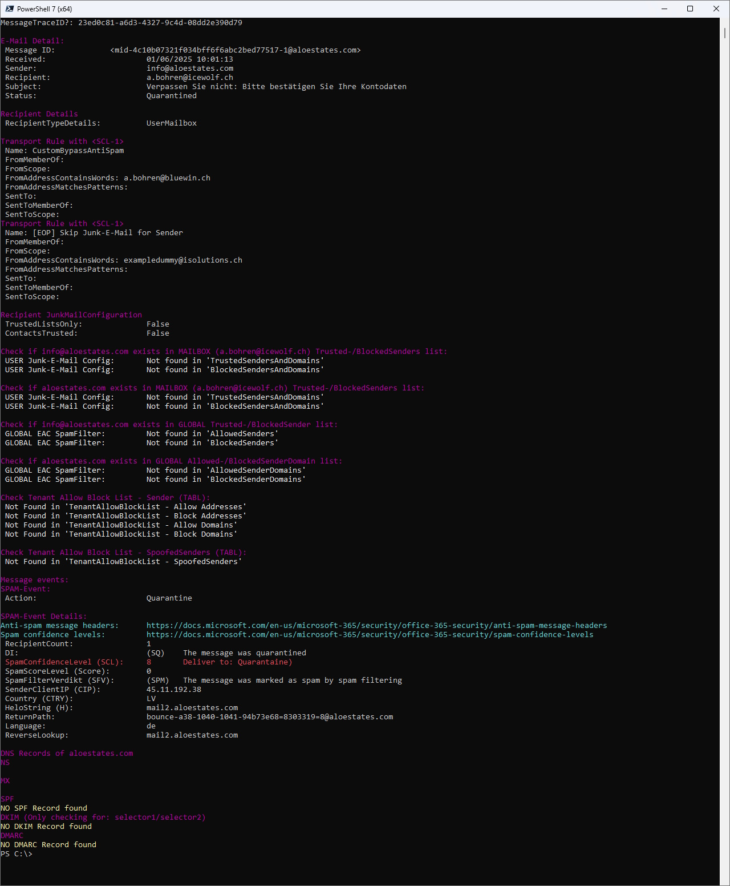

# Icewolf.EXO.SpamAnalyze

Hi All - my Name is Andres Bohren.

I am working as a Cloud Architect in the Messaging and Communication Area.

## Supported

- Exchange Online
- PowerShell 5 / 7
- Tested with 
  - Exchange Online (Exchange Online Management 3.x)

## How to Install

```pwsh
# PowerShellGet
Install-Module -Name Icewolf.EXO.SpamAnalyze

# Microsoft.PowerShell.PSResourceGet
Install-PSResource -Name Icewolf.EXO.SpamAnalyze

```

## Built in Help

```pwsh
Get-Help Invoke-SpamAnalyze -Full
```

## Usage

```pwsh
Invoke-SpamAnalyze [-RecipientAddress] <String> [-SenderAddress] <String> -StartDate <DateTime> -EndDate <DateTime> [<CommonParameters>]
Invoke-SpamAnalyze -SenderAddress SenderAddress@domain.tld -RecipientAddress RecipientAddress@domain.tld

Invoke-SpamAnalyze -SenderAddress SenderAddress@domain.tld -RecipientAddress RecipientAddress@domain.tld -StartDate "01/01/2025" -EndDate "01/10/2025"

```


Then select and paste the MessageTraceID


 

## Release Notes
V2.0.13 07.01.2025
- Added Support for Get-MessageTraceV2 / Get-MessageTraceDetailV2

V2.0.12 13.10.2024
- Updated the ReqiredModule ExchangeOnlineManagement to 3.6.0

V2.0.11 17.07.2024
- Added Try Catch for Get-EOPIPs
- Fixed an Error with DKIM Checks

V2.0.10 13.07.2023
- Added Check for EOP Relay Pool 40.95.0.0/16
- Fixes some Issues with DKIM and DMARC Checks
- General Cleanup of Module

V2.0.9 09.02.2022
- Addet Reverse Lookup and EOP IP Checks (Special thanks to @SchaedlerDaniel)
- Checks for Transport Rule with SCL-1

V2.0.8 11.11.2022
- Requires now ExchangeOnlineManagement 3.0.0
- Addet TentantAllowBlockList checks

