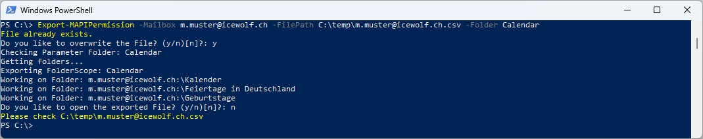
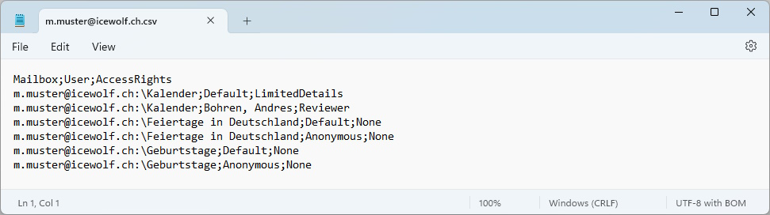
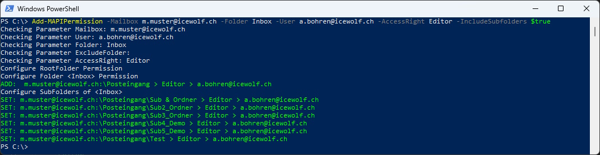
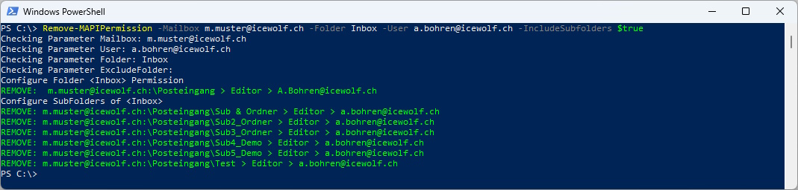

# Icewolf.Exchange.MAPI

Hi All - my Name is Andres Bohren.

I am working as a Cloud Architect in the Messaging and Communication Area.

As i have to deal with MAPI Permissions i've published this Module for the Messaging Community to simplify MAPI Permission in Exchange or Exchange Server.

It is capable of Add/Remove MAPI Permissions for all Subfolders in a Well Known Folder (Inbox / Calendar / Notes / Tasks / Contacts / SentItems / DeletedItems).

## Supported
- Exchange Server (Tested On Exchange 2016)
- Exchange Online
- PowerShell 5 / 7
- Tested with 
  - Exchange Management Shell (Exchange 2016)
  - Echange Remote PS (Exchange 2016)
  - Exchange Online (Exchange Online Management 3.x)

Probably works from Exchange 2013 to 2019

## How to Install
```pwsh
Install-Module Icewolf.Exchange.MAPI -AllowPrerelease
```

## Built in Help
```pwsh
Get-Command -Module Icewolf.Exchange.MAPI
Get-Help Add-MAPIPermission
Get-Help Remove-MAPIPermission
Get-Help Export-MAPIPermission
 ```

## How to use
Connect to Exchange or Exchange Online

```pwsh
Import-Module Icewolf.Exchange.MAPI
```

### Export MAPI Permissions into CSV
```pwsh
#Export Permissions of all Folders of a Mailbox
Export-MAPIPermission -Mailbox john.doe@yourdomain.com -FilePath C:\temp\john.doe.csv
```


That's the generated CSV File


```pwsh
#Export Permissions without Default Permissions (Default and Anonymous)
Export-MAPIPermission -Mailbox john.doe@yourdomain.com -FilePath C:\temp\john.doe.csv -ExportDefaultPermissions $false
```


That's the generated CSV File


```pwsh
#Export Permissions of a specific FolderScope 
Export-MAPIPermission -Mailbox john.doe@yourdomain.com -FilePath C:\temp\john.doe.csv -Folder Calendar
```



That's the generated CSV File



### Add MAPI Permissions to Mailbox Folders
```pwsh
Add-MAPIPermission -Mailbox john.doe@yourdomain.com -User erika.mustermann@yourdomain.com -AccessRight Reviewer -Folder Inbox [-includeSubfolders $true] [-ExcludeFolders john.doe@yourdomain.com:\Inbox\Subfolder1] [-SendOnBehalf $true]

$ExcludeFolders = @("john.doe@yourdomain.com:\Inbox\Subfolder1","john.doe@yourdomain.com:\Inbox\Subfolder2")
Add-MAPIPermission -Mailbox john.doe@yourdomain.com -User erika.mustermann@yourdomain.com -AccessRight Reviewer -Folder Inbox [-includeSubfolders $true] [-ExcludeFolders $ExcludeFolders] [-SendOnBehalf $true]
```



### Remove MAPI Permissions from Mailbox Folders
```pwsh
Remove-MAPIPermission -Mailbox john.doe@yourdomain.com -User erika.mustermann@yourdomain.com -Folder Inbox [-IncludeSubfolders $true] [-ExcludeFolders john.doe@yourdomain.com:\Inbox\Subfolder1] [-RemoveSendOnBehalf $true] [-DeleteRootFolderPermission $true]

$ExcludeFolders = @("john.doe@yourdomain.com:\Inbox\Subfolder1","john.doe@yourdomain.com:\Inbox\Subfolder2")
Remove-MAPIPermission -Mailbox john.doe@yourdomain.com -User erika.mustermann@yourdomain.com -Folder Calendar [-IncludeSubfolders $true] [-ExcludeFolders $ExcludeFolders] [-RemoveSendOnBehalf $true] [-DeleteRootFolderPermission $true]
```



Folder:
- Inbox
- Calendar
- Notes
- Tasks
- Contacts
- SentItems
- DeletedItems

AccessRights:		
- Reviewer
- Contributor
- Author
- Editor
- NonEditingAuthor
- Owner
- PublishingEditor
- PublishingAuthor

## Release Notes
V0.4.0
- Added Folders "SentItems" and "DeletedItems" to the Folder List
- Added Parameter "Folder" in Export-MAPIPermissions
- Added Parameter "ExportDefaultPermissions" in Export-MAPIPermissions

V0.3.0
- Changed Parameter -Trustee to -User (with Alias Trustee)
- Add/Remove-MAPIPermission: Added -ExcludeFolders Parameter to exclude specific Subfolders (String or Array)
- Fixed Issue with special Characters on Folder DisplayNames

V0.3.0-Preview2
- Fix spelling in a Output

V0.3.0-Preview1
- Updates and Cleaning Code

V0.2.0
- Updates and Cleaning Code

V0.1.0
- Initial Release of the Module

## Backlog
