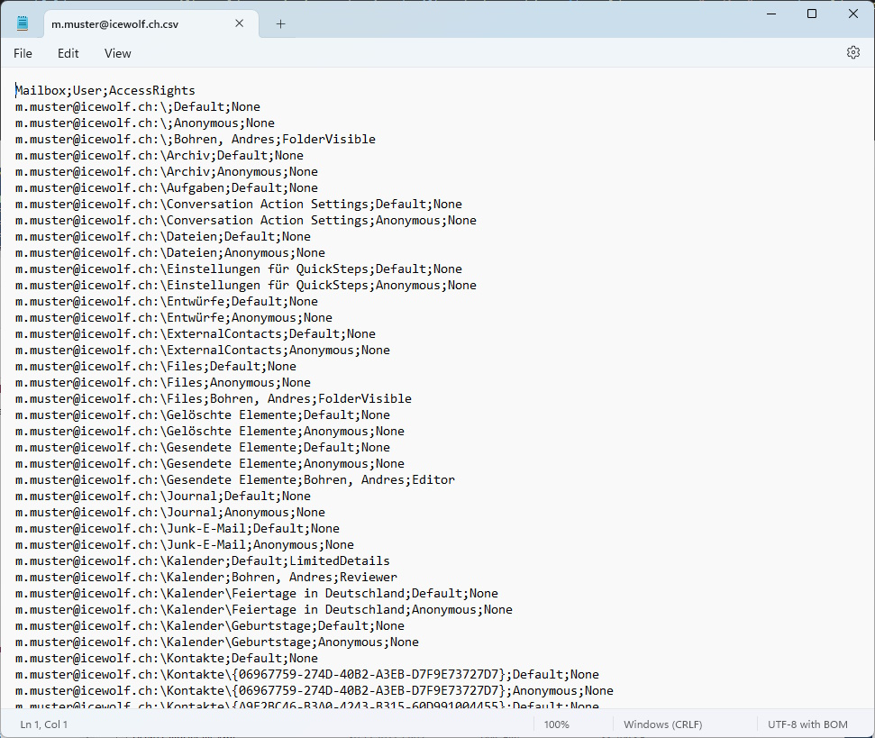

# Icewolf.Exchange.MAPI

Hi All - my Name is Andres Bohren.

I am working as a Cloud Architect in the Messaging and Communication Area.

As i have to deal with MAPI Permissions i've published this Module for the Messaging Community to simplify MAPI Permission in Exchange or Exchange Server.

It is capable of Add/Remove MAPI Permissions for all Subfolders in a Well Known Folder (Inbox / Calendar / Notes / Tasks / Contacts).

## Supported
- Exchange Server (Tested On Exchange 2016)
- Exchange Online
- PowerShell 5 / 7
- Tested with 
  - Exchange Management Shell (Exchange 2016)
  - Echange Remote PS (Exchange 2016)
  - Exchange Online (Exchange Online Management 3.x)

Probably works from Exchange 2013 to 2019

## How to Install
```
Install-Module Icewolf.Exchange.MAPI -AllowPrerelease
```

## Built in Help
```
Get-Command -Module Icewolf.Exchange.MAPI
Get-Help Add-MAPIPermission
Get-Help Remove-MAPIPermission
Get-Help Export-MAPIPermission
 ```

## How to use
Connect to Exchange or Exchange Online

```
Import-Module Icewolf.Exchange.MAPI
```

### Export MAPI Permissions into CSV
```
Export-MAPIPermission -Mailbox john.doe@yourdomain.com -FilePath C:\temp\john.doe.txt
```


That's the generated CSV File



### Add MAPI Permissions to Mailbox Folders
```
Add-MAPIPermission -Mailbox john.doe@yourdomain.com -Trustee erika.mustermann@yourdomain.com -AccessRight Reviewer -Folder Inbox [-includeSubfolders $true] [-SendOnBehalf $true]
```


### Remove MAPI Permissions from Mailbox Folders
```
Remove-MAPIPermission -Mailbox john.doe@yourdomain.ch -Trustee erika.mustermann@yourdomain.com -Folder Calendar [-IncludeSubfolders $true] [-RemoveSendOnBehalf $true] [-DeleteRootFolderPermission $true]
```


Folder:
- Inbox
- Calendar
- Notes
- Tasks
- Contacts

AccessRights:		
- Reviewer
- Contributor
- Author
- Editor
- NonEditingAuthor
- Owner
- PublishingEditor
- PublishingAuthor