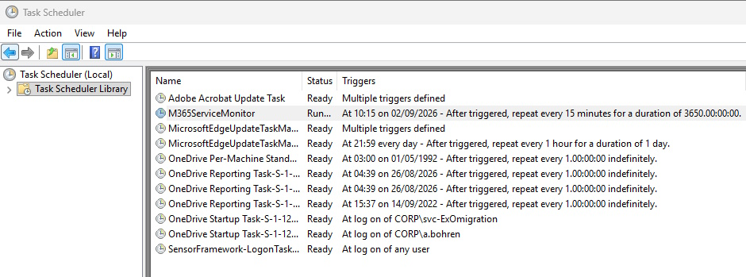

## About this Script

- PowerShell Script to monitor M365 Service Health and Issues using MS Graph API.
- Create a HTML File as Output
- Send new Issues per Mail to defined Recipients

## Requirements

This Script requires

- Entra App Registration with Certificate Authentication and following API Permissions:
  - ServiceHealth.Read.All
  - ServiceMessage.Read.All

If Configuration Parameter [bool]$AuthTokenWithoutModule = $false

- MSAL.PS Module for PowerShell 5.1
- PSMSALNet Module for PowerShell 7.x

## Installation

Copy Script to a Folder on your Machine (For Example: C:\M365Monitor)

```pwsh
$Path = "C:\M365Monitor"
New-Item -Path $Path  -ItemType Directory
Set-Location -Path $Path
```

## Entra Application

- Create Entra App Registration with Certificate Authentication and following API Permissions:
  - ServiceHealth.Read.All
  - ServiceMessage.Read.All

## Certificate

You need to have a Certificate with a Private Key

```pwsh
###############################################################################
# Create SelfSignedCertificate
# https://docs.microsoft.com/en-us/powershell/module/pki/new-selfsignedcertificate?view=windowsserver2022-ps
###############################################################################
Get-ChildItem -Path cert:\CurrentUser\my | Format-Table
$Subject = "DemoCert"
$NotAfter = (Get-Date).AddMonths(+24)
$Cert = New-SelfSignedCertificate -Subject $Subject -CertStoreLocation "Cert:\CurrentUser\My" -KeySpec Signature -NotAfter $Notafter -KeyExportPolicy Exportable
```

### Create Exchange Online Service Principal

Required only when: "SendMailViaGraphAPI=$True"

Create Exchange Online Service Principal and Assign Mail.Send Perissions for a SenderMailbox

```pwsh
###############################################################################
# 
###############################################################################
Connect-ExchangeOnline -ShowBanner:$false
$AppID = "29581967-458b-4c7a-a4f7-03fa440c0e13" #ServiceCommunications
$AppObjectID = "1adfae9a-9d30-49c1-b786-0f3dd70f8a1e" #ObjectID of the Enterprise App
$DisplayName = "EXO Serviceprincipal ServiceCommunications"
New-ServicePrincipal -AppId $AppID -ObjectId $AppObjectID -DisplayName $DisplayName

# New-ManagementScope
New-ManagementScope -Name "User1" -RecipientRestrictionFilter "PrimarySmtpAddress -eq 'User1@domain.tld'"
Get-ManagementScope

# New-ManagementRoleAssignment
$SP = Get-ServicePrincipal | Where-Object {$_.AppId -eq $AppID}
$ServiceId = $SP.ObjectId
New-ManagementRoleAssignment -App $ServiceId -Role "Application Mail.Send" -CustomResourceScope "User1"
Get-ManagementRoleAssignment | Where-Object {$_.Role -eq "Application Mail.Send" -and $_.App -eq "$ServiceId"}
```

## Configuration

In the Script contains a Configuration Section where you need to set up the Variables according to your Environment

```pwsh
### START Configuration Section ###
...
### END Configuration Section ###
```

### Services


You need to define, what services you want to Monitor.

```pwsh
#Create Array of Services to monitor
[array]$ArrayServices = "Exchange Online", "Microsoft Entra", "Microsoft Intune", "Microsoft 365 for the web", "Microsoft 365 apps", "SharePoint Online", "Microsoft OneDrive", "Microsoft Teams", "Planner", "Microsoft Purview"
```

### Entra App  Details

You need to put in your TenantID, AppID, CertificateThumbprint and the CertStore

```pwsh
$TenantId = "46bbad84-29f0-4e03-8d34-f6841a5071ad"
$AppID = "29581967-458b-4c7a-a4f7-03fa440c0e13" #ServiceCommunications
$CertificateThumbprint = "FB40D47A0C0A23EA297B44A57272BCED352D0002"  #CN=O365Powershell5
$CertStore = "LocalMachine" # CurrentUser / LocalMachine
```

### Auth Token Without Module

I've written a fuction to get the AccessToken without the MSAL.PS (PowerShell 5.1) or MSAL.PS (PowerShell 7.x)

```pwsh
[bool]$AuthTokenWithoutModule = $True  #$True / $False
```

### Log Purge

The Script creates a Logfile M365ServiceMonitoring_YYYY-MM-DD.log in the Script Directory.
Here you can define when the *.log Files will be purged.

```pwsh
#Log Purge
[int]$LogPurgeDays = 30
```

### Email Settings

You need to define a Sender and can add multiple Recipients.
You can send the Mail via SMTP or via Graph.

```pwsh
#Email Settings
[string]$MailSender = "postmaster@icewolf.ch"
[array]$MailRecipient = "a.bohren@icewolf.ch","postmaster@icewolf.ch"
[string]$SMTPServer = "smtprelay.corp.icewolf.ch"
[bool]$SendMailViaGraphAPI = $true
```

### Register-Scheduled Task

This Directory contains also a PowerShell File "Register-ScheduledTask.ps1" (Need to be run as Administrator).

- It will Register the Script to run Sheduled Task running under the "System" Account.
- You will need to import the Certificate with Private Key into LocalMachine Certificate Store
- You will need to assign Permissions to NetworkService for the Private Key

You need to run 'taskschd.msc' as Administrator to view the task

