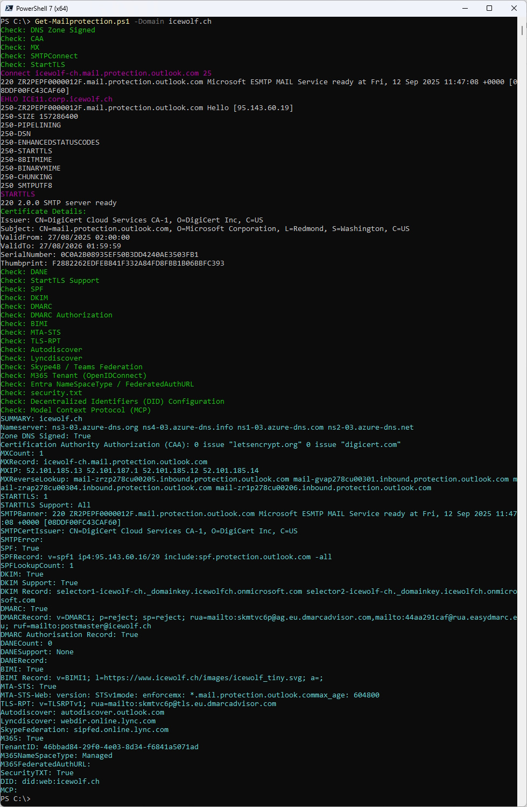
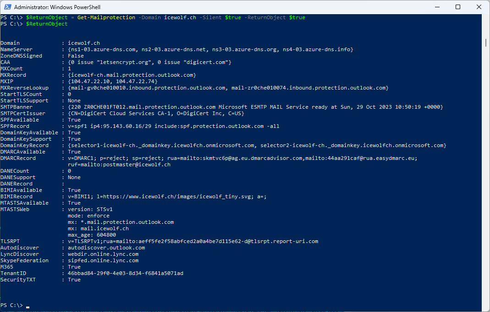

# Get-Mailprotection
I am working as a Cloud Architect in the Messaging and Communication Area.
This is why i often need to check, what security Settings exists for a specific Domain.
A lot of this Information is published in Public DNS. So i wrote a PowerShell Script to show this Information.

This Script checks diffrent DNS Records about a Domain - mostly about Mailsecurity Settings.
It checks for the following Information
- DNS Zone Signed (DNSSEC)
- CAA (Certification Authority Authorization)
- MX (MailExchanger)
- MX IP
- MX Reverse Lookup
- Connects to the MX Servers and checks for STARTTLS and shows SMTPBanner and Certificate Information
- SPF (Sender Policy Framework)
- DKIM (DomainKeys Identified Mail)
- DMARC (Domain-based Message Authentication, Reporting and Conformance)
- DANE (DNS-based Authentication of Named Entities)
- BIMI (Brand Indicators for Message Identification)
- MTA-STS (SMTP MTA Strict Transport Security)
- MTA-STS Web (https://mta-sts.domain.tld/.well-known/mta-sts.txt)
- TLS-RPT (TLS Reporting)
- Autodiscover
- Lyncdiscover
- Lync/Skype/Teamsfederation
- M365 (Check via Open ID Connect)
- M365 TenantID

## How to Install
Find Script in the PowerShell Gallery
```pwsh
Find-Script Get-Mailprotection
```

Install Script from the PowerShell Gallery
```pwsh
Install-Script Get-Mailprotection
```


## How to use
Output to Console
```pwsh
Get-Mailprotection -Domain domain.tld
```

No SMTP Connection to MX Records / No Check for STARTTLS
```pwsh
Get-Mailprotection -Domain domain.tld -SMTPConnect $False
```

Return the Result as Object
```pwsh
$ReturnObject = Get-Mailprotection -Domain domain.tld -ReturnObject $true
```



You don't want the Script to make a SMTP Connection to figure out if the Mailservers in the MX Records support STARTTLS
```pwsh
Get-Mailprotection -Domain domain.tld -SMTPConnect $False
```


You want a return Object that has all the Properties
```pwsh
$MP = Get-Mailprotection -Domain domain.tld -ReturnObject $True
$MP.NameServer
$MP.MXRecord
```



# Details
## DNS Zone Signed (DNSSEC)
```pwsh
$Domain = "domain.tld"
$URI = "https://dns.google/resolve?name=$Domain&type=NS"	
$json = Invoke-RestMethod -URI $URI
$json
```

I had to do a DNS over HTTPS (DoH) Query to check this and use the Google Resolver.
If the JSON Returns an AD = True, it means that the DNS Zone is Signed (DNSSEC).


## CAA (Certification Authority Authorization)
```pwsh
$Domain = "<domain.tld>"
$json = Invoke-RestMethod -URI "https://dns.google/resolve?name=$Domain&type=CAA"
$json.Answer.data
```

DNS Certification Authority Authorization
https://en.wikipedia.org/wiki/DNS_Certification_Authority_Authorization

The CAA Record Type returns a List of Certification Authorities that are allowed to issue Certificates for that Domain.

## MX (MailExchanger)
```pwsh
Resolve-DnsName -Type MX -Name domain.tld
```

It will return the Names of the MailExchange (Mailservers) for that Domain

## MX IP
```pwsh
Resolve-DnsName -Name <Mailserver FQDN>
Resolve-DnsName -Name mail.icewolf.ch
```

It will return the IP's of the Mailserver in the MX DNS Record

## MX Reverse Lookup
```pwsh
Resolve-DnsName -Name <IP>
Resolve-DnsName -Name 104.47.22.10
```

It will return the Name of the IP from the MX Record (Reverse Lookup)
Some Mailservers Require to have a valid Reverse Lookup.

## Connects to the MX Servers and checks for STARTTLS and shows Certificate Information
Connect to the Mailserver on Port 25 and send an
>ehlo hostname

Then checks for "STARTTLS" in the Capabilities of the Mailserver.
Also shows the Details of the Certificate

## SPF (Sender Policy Framework)
```pwsh
Resolve-DnsName -Type TXT -Name <domain.tld>
Resolve-DnsName -Type TXT -Name icewolf.ch
```

SPF (Sender Policy Framework)
https://en.wikipedia.org/wiki/Sender_Policy_Framework

SPF is a TXT Record that starts with "V=SPF1"
The SPF Record controls what Mailservers are allowed to send Mails in the Name of the Domain
Envelope: Mail from

## DKIM (DomainKeys Identified Mail)
DKIM Records are hard because the Selector can be literally anything.
One way is to try if the Subdomain "_domainkey.domain.tld" gives a Response

```pwsh
$dnshost = "_domainkey.domain.tld"
Resolve-DnsName -Name $dnshost -Type TXT -ErrorAction SilentlyContinue
```

The Selector for Exchange Online are selector1 and selector2
```pwsh
Resolve-DnsName -Name selector1._domainkey.domain.tld -Type CNAME -ErrorAction SilentlyContinue
Resolve-DnsName -Name selector2._domainkey.domain.tld -Type CNAME -ErrorAction SilentlyContinue
```

## DMARC (Domain-based Message Authentication, Reporting and Conformance)
```pwsh
Resolve-DnsName -Name _dmarc.domain.tld -Type TXT
```

## DANE (DNS-based Authentication of Named Entities)
```pwsh
$TLSAQuery = "_25._tcp.mailserver.domain.tld"
$json = Invoke-RestMethod -URI "https://dns.google/resolve?name=$TLSAQuery&type=TLSA"
```

## BIMI (Brand Indicators for Message Identification)
```pwsh
Resolve-DnsName -Name default._bimi.domain.tld -Type TXT
```

## MTA-STS (SMTP MTA Strict Transport Security)
>Resolve-DnsName -Name _mta-sts.domain.tld -Type TXT

## MTA-STS Web (https://mta-sts.domain.tld/.well-known/mta-sts.txt)
```pwsh
Invoke-WebRequest -URI https://mta-sts.domain.tld/.well-known/mta-sts.txt
```

## TLS-RPT (TLS Reporting)
```pwsh
$TLSRPTQuery = "_smtp._tls.domain.tld"
Resolve-DnsName -Name $TLSRPTQuery -Type TXT
```

## Autodiscover
```pwsh
Resolve-DnsName -Name autodiscover.$Domain -Type A
Resolve-DnsName -Name autodiscover.$Domain -Type CNAME
Resolve-DnsName _autodiscover._tcp.$Domain -Type SRV
```

## Lyncdiscover
```pwsh
Resolve-DnsName -Name lyncdiscover.domain.tld -Type A 
Resolve-DnsName -Name lyncdiscover.domain.tld -Type CNAME
```

## Lync/Skype/Teamsfederation
```pwsh
Resolve-DnsName -Name _sipfederationtls._tcp.domain.tld -Type SRV
```

## M365 (Check via Open ID Connect) / TenantID
```pwsh
$Response = Invoke-WebRequest -UseBasicParsing https://login.windows.net/domain.tld/.well-known/openid-configuration
$TenantID = ($Response | ConvertFrom-Json).token_endpoint.Split('/')[3]
```

## Security.txt
https://securitytxt.org/

Checks for the presence of the security.txt at these two locations

https://$Domain/.well-known/security.txt
https://$Domain/security.txt


```pwsh
[bool]$SecurityTXTAvailable = $false
$URI = "https://$Domain/.well-known/security.txt"
try {
	$Response = Invoke-WebRequest -URI $URI -TimeoutSec 1
	If ($Null -ne $Response)
	{
		[bool]$SecurityTXTAvailable = $true
	}
} catch {
	Write-Host "An exception was caught: $($_.Exception.Message)" -ForegroundColor Yellow
}

$URI = "https://$Domain/security.txt"
try {
	$Response = Invoke-WebRequest -URI $URI -TimeoutSec 1
	If ($Null -ne $Response)
	{
		[bool]$SecurityTXTAvailable = $true
	}
} catch {
	Write-Host "An exception was caught: $($_.Exception.Message)" -ForegroundColor Yellow
}
$SecurityTXTAvailable
```

Regards
Andres Bohren