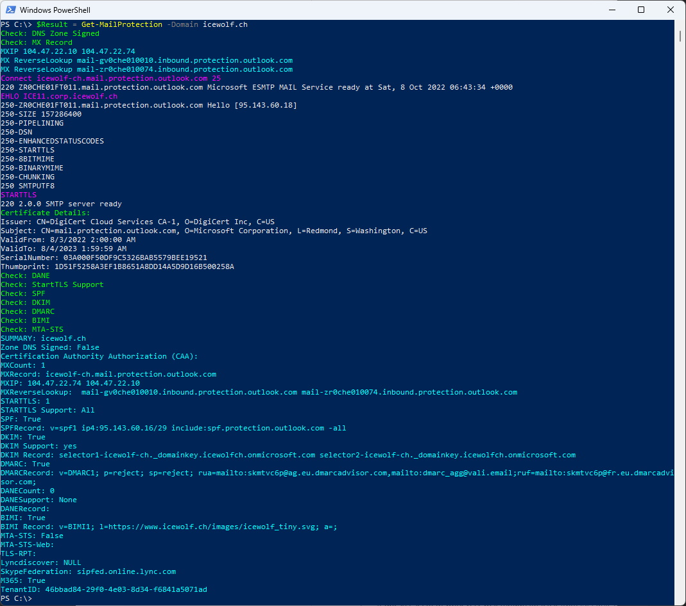

# Get-Mailprotection
I am working as a Cloud Architect in the Messaging and Communication Area.
This is why i often need to check, what security Settings exists for a specific Domain.
A lot of this Information is published in Public DNS. So i wrote a PowerShell Script to show this Information.

This Script checks diffrent DNS Records about a Domain - mostly about Mailsecurity Settings.
It checks for the following Information
- DNS Zone Signed (DNSSEC)
- CAA (Certification Authority Authorization)
- MX (MailExchanger)
- MX IP
- MX Reverse Lookup
- Connects to the MX Servers and checks for STARTTLS and shows Certificate Information
- SPF (Sender Policy Framework)
- DKIM (DomainKeys Identified Mail)
- DMARC (Domain-based Message Authentication, Reporting and Conformance)
- DANE (DNS-based Authentication of Named Entities)
- BIMI (Brand Indicators for Message Identification)
- MTA-STS (SMTP MTA Strict Transport Security)
- MTA-STS Web (https://mta-sts.domain.tld/.well-known/mta-sts.txt)
- TLS-RPT (TLS Reporting)
- Lyncdiscover
- Lync/Skype/Teamsfederation
- M365 (Check via Open ID Connect)
- M365 TenantID

## How to Install
> Find-Script Get-Mailprotection

> Install-Script Get-Mailprotection

## How to use
>$Result = Get-Mailprotection -Domain domain.tld

# Details
## DNS Zone Signed (DNSSEC)
>$Domain = "domain.tld"
$URI = "https://dns.google/resolve?name=$Domain&type=NS"	
$json = Invoke-RestMethod -URI $URI
$json

I had to do a DNS over HTTPS (DoH) Query to check this and use the Goolle Resolver.
If the JSON Returns an AD = True, it means that the DNS Zone is Signed (DNSSEC).

## CAA (Certification Authority Authorization)
>$Domain = "<domain.tld>"
$json = Invoke-RestMethod -URI "https://dns.google/resolve?name=$Domain&type=CAA"
$json.Answer.data

DNS Certification Authority Authorization
https://en.wikipedia.org/wiki/DNS_Certification_Authority_Authorization

The CAA Record Type returns a List of Certification Authorities that are allowed to issue Certificates for that Domain.

## MX (MailExchanger)
>Resolve-DnsName -Type MX -Name domain.tld

It will return the Names of the MailExchange (Mailservers) for that Domain

## MX IP
>Resolve-DnsName -Name <Mailserver FQDN>
>Resolve-DnsName -Name mail.icewolf.ch

It will return the IP's of the Mailserver in the MX DNS Record

## MX Reverse Lookup
>Resolve-DnsName -Name <IP>
>Resolve-DnsName -Name 104.47.22.10

It will return the Name of the IP from the MX Record (Reverse Lookup)
Some Mailservers Require to have a valid Reverse Lookup.

## Connects to the MX Servers and checks for STARTTLS and shows Certificate Information
Connect to the Mailserver on Port 25 and send an
>ehlo hostname

Then checks for "STARTTLS" in the Capabilities of the Mailserver.
Also shows the Details of the Certificate
## SPF (Sender Policy Framework)
>Resolve-DnsName -Type TXT -Name <domain.tld>
>Resolve-DnsName -Type TXT -Name icewolf.ch

SPF (Sender Policy Framework)
https://en.wikipedia.org/wiki/Sender_Policy_Framework

SPF is a TXT Record that starts with "V=SPF1"
The SPF Record controls what Mailservers are allowed to send Mails in the Name of the Domain
Envelope: Mail from

## DKIM (DomainKeys Identified Mail)
DKIM Records are hard because the Selector can be literally anything.
One way is to try if the Subdomain "_domainkey.domain.tld" 

>$dnshost = "_domainkey." + $Domain
>Resolve-DnsName -Name $dnshost -Type TXT -ErrorAction SilentlyContinue

The Records for Exchange Online are

>Resolve-DnsName -Name selector1._domainkey.domain.tld -Type CNAME -ErrorAction SilentlyContinue
>Resolve-DnsName -Name selector2._domainkey.domain.tld -Type CNAME -ErrorAction SilentlyContinue

$dnshost1 = "selector1._domainkey." + $Domain
		$dnshost2 = "selector2._domainkey." + $Domain
		$DomainkeyS1 = Resolve-DnsName -Name $dnshost1 -Type CNAME -ErrorAction SilentlyContinue
		$DomainkeyS2 = Resolve-DnsName -Name $dnshost2 -Type CNAME -ErrorAction SilentlyContinue

## DMARC (Domain-based Message Authentication, Reporting and Conformance)

## DANE (DNS-based Authentication of Named Entities)
## BIMI (Brand Indicators for Message Identification)
## MTA-STS (SMTP MTA Strict Transport Security)
## MTA-STS Web (https://mta-sts.domain.tld/.well-known/mta-sts.txt)
## TLS-RPT (TLS Reporting)
## Lyncdiscover
## Lync/Skype/Teamsfederation
## M365 (Check via Open ID Connect)
## M365 TenantID

Regards
Andres Bohren