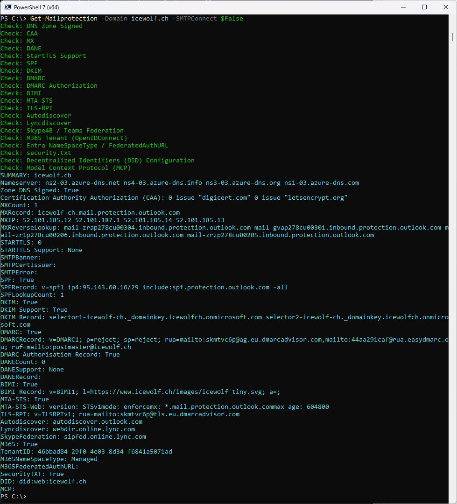
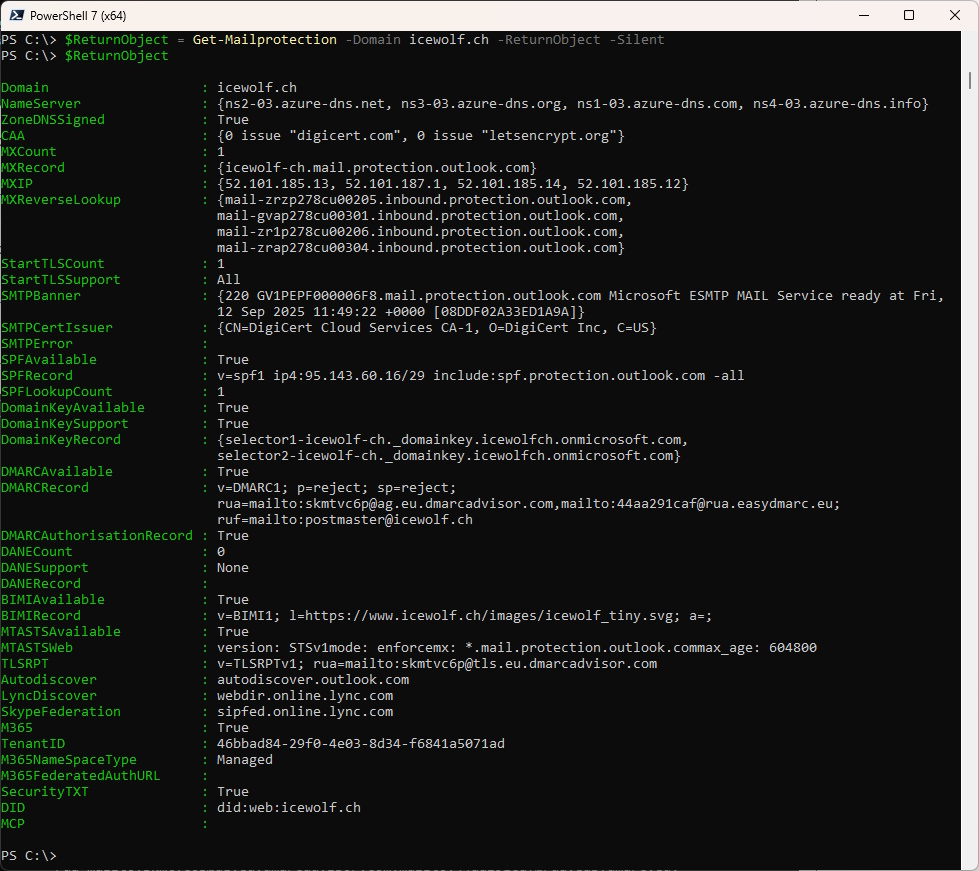

# Get-Mailprotection
I am working as a Cloud Architect in the Messaging and Communication Area.
This is why i often need to check, what security Settings exists for a specific Domain.
A lot of this Information is published in Public DNS or HTTPS. So i wrote a PowerShell Script to show this Information.

This Script checks diffrent DNS Records about a Domain - mostly about Mailsecurity Settings.
It checks for the following Information
- DNS Zone Signed (DNSSEC)
- CAA (Certification Authority Authorization)
- MX (MailExchanger)
- MX IP
- MX Reverse Lookup
- Connects to the MX Servers and checks for STARTTLS and shows SMTPBanner and Certificate Information
- SPF (Sender Policy Framework)
- DKIM (DomainKeys Identified Mail)
- DMARC (Domain-based Message Authentication, Reporting and Conformance)
- DANE (DNS-based Authentication of Named Entities)
- BIMI (Brand Indicators for Message Identification)
- MTA-STS (SMTP MTA Strict Transport Security)
- MTA-STS Web (https://mta-sts.domain.tld/.well-known/mta-sts.txt)
- TLS-RPT (TLS Reporting)
- Autodiscover
- Lyncdiscover
- Lync/Skype/Teamsfederation
- M365 (Check via Open ID Connect)
- M365 TenantID
- Security.txt https://securitytxt.org/

## How to Install
Find Script in the PowerShell Gallery
```pwsh
Find-Script Get-Mailprotection
#or
Find-PSResource Get-Mailprotection
```

Install Script from the PowerShell Gallery
```pwsh
Install-Script Get-Mailprotection
#or
Install-PSResource Get-Mailprotection
```


## How to use
Output to Console
```pwsh
Get-Mailprotection -Domain domain.tld
```


No SMTP Connection to MX Records / No Check for STARTTLS
```pwsh
Get-Mailprotection -Domain domain.tld -SMTPConnect $False
```



Return the Result as Object
```pwsh
$ReturnObject = Get-Mailprotection -Domain domain.tld -ReturnObject $true
```


Return the Result as Object with no Output to Console
```pwsh
$ReturnObject = Get-Mailprotection -Domain domain.tld -ReturnObject $true -Silent $True
$ReturnObject
```




# Details
## DNS Zone Signed (DNSSEC)
I had to do a DNS over HTTPS (DoH) Query to check this and use the Google Resolver.
If the JSON Returns an AD = True, it means that the DNS Zone is Signed (DNSSEC).

```pwsh
$Domain = "domain.tld"
$URI = "https://dns.google/resolve?name=$Domain&type=NS"	
$json = Invoke-RestMethod -URI $URI
$json
```

## CAA (Certification Authority Authorization)
DNS Certification Authority Authorization
https://en.wikipedia.org/wiki/DNS_Certification_Authority_Authorization

The CAA Record Type returns a List of Certification Authorities that are allowed to issue Certificates for that Domain.

```pwsh
$Domain = "domain.tld"
$json = Invoke-RestMethod -URI "https://dns.google/resolve?name=$Domain&type=CAA"
$json.Answer.data
```

## MX (MailExchanger)
MX Record defined here [rfc1035](https://datatracker.ietf.org/doc/html/rfc1035)

Get the MX (MailExchanger) DNS Records for a Domain
Will return the Names of the MailExchange (Mailservers) for a Domain

```pwsh
$Domain = "domain.tld"
Resolve-DnsName -Type MX -Name domain.tld
```

## MX IP
It will return the IP's of the Mailserver in the MX DNS Record

```pwsh
$Domain = "domain.tld"
Resolve-DnsName -Name $Domain
```

## MX Reverse Lookup
It will return the Name of the IP from the MX Record (Reverse Lookup)
Some Mailservers Require to have a valid Reverse Lookup.

```pwsh
Resolve-DnsName -Name <IP>
Resolve-DnsName -Name 104.47.22.10
```


## Connects to the MX Servers and checks for STARTTLS and shows Certificate Information
Connect to the Mailserver on Port 25 and send an
>ehlo hostname

Then checks for "STARTTLS" in the Capabilities of the Mailserver.
Also shows the Details of the Certificate

Used most Code from here
https://github.com/BohrenAn/GitHub_PowerShellScripts/blob/main/Exchange/Get-SMTPCertificate.ps1

## SPF (Sender Policy Framework)
SPF exists since 2003 with Updates 2006 and 2014 [rfc7208](https://datatracker.ietf.org/doc/html/rfc7208)

SPF (Sender Policy Framework)
https://en.wikipedia.org/wiki/Sender_Policy_Framework

SPF is a TXT Record that starts with "V=SPF1"
The SPF Record controls what Mailservers are allowed to send Mails in the Name of the Domain
Envelope: Mail from

```pwsh
$Domain = "domain.tld"
Resolve-DnsName -Type TXT -Name $Domain
```

## DKIM (DomainKeys Identified Mail)
It is defined in [rfc6376](https://datatracker.ietf.org/doc/html/rfc6376) from 2011 with updates in [rfc8301](https://datatracker.ietf.org/doc/html/rfc8301) and [rfc8463](https://datatracker.ietf.org/doc/html/rfc8463).

DKIM Records are hard do detect because the Selector can be literally anything.
One way is to try if the Subdomain "_domainkey.domain.tld" gives a Response

```pwsh
$Domain = "domain.tld"
$dnshost = "_domainkey.$Domain"
Resolve-DnsName -Name $dnshost -Type TXT -ErrorAction SilentlyContinue
```

The Selector for Exchange Online are selector1 and selector2
```pwsh
$Domain = "domain.tld"
Resolve-DnsName -Name selector1._domainkey.$Domain -Type CNAME -ErrorAction SilentlyContinue
Resolve-DnsName -Name selector2._domainkey.$Domain -Type CNAME -ErrorAction SilentlyContinue
```

## DMARC (Domain-based Message Authentication, Reporting and Conformance)
DMARC Exists since 2015 defined in [rfc7489](https://datatracker.ietf.org/doc/html/rfc7489)

```pwsh
$Domain = "domain.tld"
Resolve-DnsName -Name _dmarc.$Domain -Type TXT
```

## DANE (DNS-based Authentication of Named Entities)
Exists since 2015 [rfc8461](https://datatracker.ietf.org/doc/html/rfc8461)

I’ve explained how [DANE works](https://blog.icewolf.ch/archive/2022/01/21/dane-dns-based-authentification-of-named-entities/) in one of my Blog Articles

```pwsh
$Domain = "domain.tld"
$MX = Resolve-DnsName -Type MX -Name domain.tld
Foreach ($MXEntry in $MX)
{
	$TLSAQuery = "_25._tcp.mailserver.domain.tld"
	$json = Invoke-RestMethod -URI "https://dns.google/resolve?name=$TLSAQuery&type=TLSA"
	$json.Answer.Data
}
```

## BIMI (Brand Indicators for Message Identification)
```pwsh
$Domain = "domain.tld"
Resolve-DnsName -Name default._bimi.$Domain -Type TXT | where {$_.Strings -match "v=BIMI1"}
```

## MTA-STS (SMTP MTA Strict Transport Security)
Exists since 2018 [rfc8461](https://datatracker.ietf.org/doc/html/rfc8461)

```pwsh
$Domain = "domain.tld"
Resolve-DnsName -Name _mta-sts.$Domain -Type TXT | where {$_.Strings -match "v=STSv1"}
```

## MTA-STS Web / MTA-STS Policy
Exists since 2018 [rfc8461](https://datatracker.ietf.org/doc/html/rfc8461)

Searches for the MTA-STS Policy
https://mta-sts.domain.tld/.well-known/mta-sts.txt

```pwsh
$Domain = "domain.tld"
$Response = Invoke-WebRequest -URI https://mta-sts.$Domain/.well-known/mta-sts.txt -TimeoutSec 1
$Response.Content
```

## TLS-RPT (TLS Reporting)
Exists since 2018 [rfc8461](https://datatracker.ietf.org/doc/html/rfc8461)

```pwsh
$Domain = "domain.tld"
$TLSRPTQuery = "_smtp._tls.$Domain"
Resolve-DnsName -Name $TLSRPTQuery -Type TXT
```

## Autodiscover
```pwsh
$Domain = "domain.tld"
Resolve-DnsName -Name autodiscover.$Domain -Type A
Resolve-DnsName -Name autodiscover.$Domain -Type CNAME
Resolve-DnsName _autodiscover._tcp.$Domain -Type SRV
```

## Lyncdiscover
```pwsh
$Domain = "domain.tld"
Resolve-DnsName -Name lyncdiscover.domain.tld -Type A
Resolve-DnsName -Name lyncdiscover.domain.tld -Type CNAME
```

## Lync/Skype/Teamsfederation
```pwsh
$Domain = "domain.tld"
Resolve-DnsName -Name _sipfederationtls._tcp.$Domain -Type SRV
```

## M365 (Check via Open ID Connect) / TenantID
```pwsh
$Domain = "domain.tld"
$Response = Invoke-WebRequest -UseBasicParsing https://login.windows.net/$Domain/.well-known/openid-configuration
$TenantID = ($Response | ConvertFrom-Json).token_endpoint.Split('/')[3]
```

## Security.txt
Exists since 2022 [rfc9116](https://datatracker.ietf.org/doc/html/rfc9116)

https://securitytxt.org/

Checks for the presence of the security.txt at these two locations
- https://domain.tld/.well-known/security.txt
- https://domain.tld/security.txt


```pwsh
[bool]$SecurityTXTAvailable = $false
$URI = "https://$Domain/.well-known/security.txt"
try {
	$Response = Invoke-WebRequest -URI $URI -TimeoutSec 1
	If ($Null -ne $Response)
	{
		[bool]$SecurityTXTAvailable = $true
	}
} catch {
	Write-Host "An exception was caught: $($_.Exception.Message)" -ForegroundColor Yellow
}

$URI = "https://$Domain/security.txt"
try {
	$Response = Invoke-WebRequest -URI $URI -TimeoutSec 1
	If ($Null -ne $Response)
	{
		[bool]$SecurityTXTAvailable = $true
	}
} catch {
	Write-Host "An exception was caught: $($_.Exception.Message)" -ForegroundColor Yellow
}
$SecurityTXTAvailable
```

## History
- Version 1.0 / 21.02.2015 Initial Version
- Version 1.1 / 08.04.2015 IDN Domains / Crawled Domains / Unique Domains
- Version 1.2 / 13.04.2015 STARTTLS Support
- Version 1.3 / 26.08.2022 Addet BIMI / DANE / MTA-STS / M365 Checks
- Version 1.4 / 03.10.2022 Addet Reverse Lookup of MX Records / CAA Lookup / TLS-RPT Lookup
- Version 1.5 / 13.10.2022 Fixed Lyncdiscover / Added NS Records & Autodiscover / Minor fixes
- Version 1.6 / 03.04.2023 Addet Parameter -SMTPConnect [true/false] and -ReturnObject [false/true] that is now a PSCustomObject
- Version 1.7 / 16.05.2023 Fixed Lyncdiscover CNAME
- Version 1.8 / 30.09.2023 - Andres Bohren
  - Fixed ReturnObject Nameserver
  - Changed MTA-STSAvailable to MTA-STSAvailable and MTA-STSWeb to MTASTSWeb in ReturnObject
  - ReturnObject of MTASTSWeb is now String
  - ReturnObject of TLSRPT is now String
  - ReturnObject of MXIP is now Array
  - ReturnObject of CAA is now Array
- Version 1.9 / 29.10.2023 - Andres Bohren
  - Fixed Error in Nameserver Output
  - Improved SMTP Connect
  - Addet SMTPBanner
  - Addet SMTPCertificateIssuer
  - Fixed Errorhandling in DANE and NS Lookups
  - Better Errorhandling in SMTPConnect
  - Fixed Autodiscover Lookup
  - Fixed Lyncdiscover Lookup
  - General cleanup of Code
  - Added Security.txt https://securitytxt.org/
  - Added -Silent Parameter

Kind Regards\
Andres Bohren